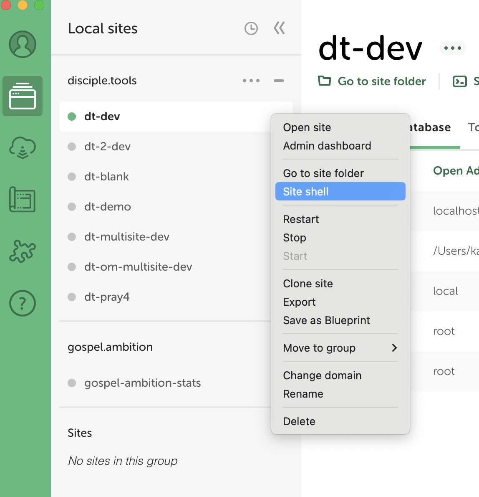

# Testing

## Setup LocalWP Testing Environment

1. See [D.T Unit Tests Documentation](https://developers.disciple.tools/local-setup/theme-phpunit-tests) for better context.

2. See screenshot regarding how to go about opening the Site Shell.



3. On Ln:154 of `./bin/install-wp-tests.sh`, delete `—protocal=tcp`

4. Next, identify the port number from the url shown when opening `AdminerEvo`.

5. Next, run the following command from within `dt-plugin` root dir.

```Bash
./bin/install-wp-tests.sh local-test root root localhost:10040
```
Use the port number sourced from step 4.

6. Once command has successfully completed, with no errors; run the tests with the following command:

```Bash
./vendor/bin/phpunit
```

7. On a successful run, the following output should be shown:

```Bash
Time: 00:00.679, Memory: 14.00 MB
OK (39 tests, 64 assertions)
```
